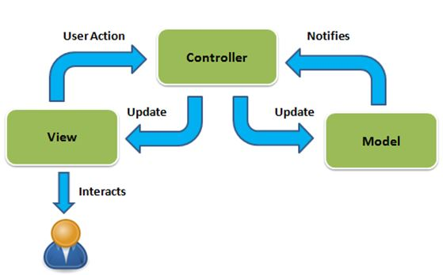
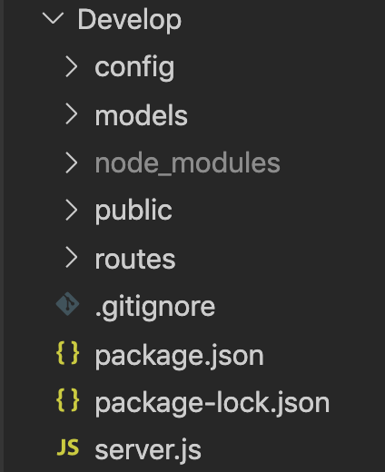
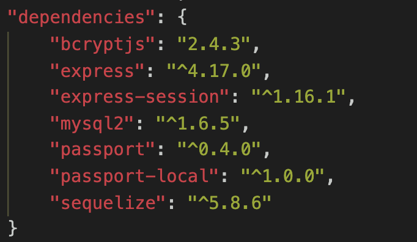
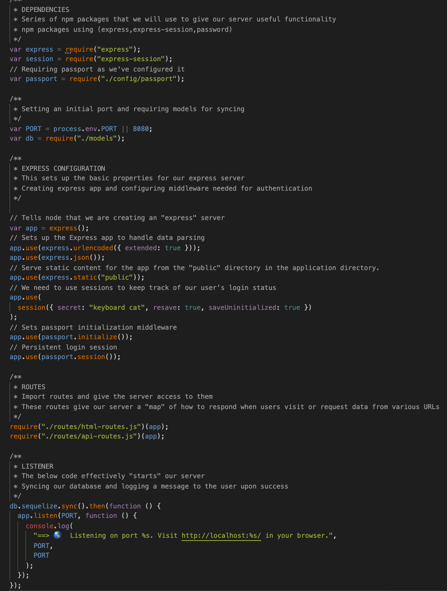
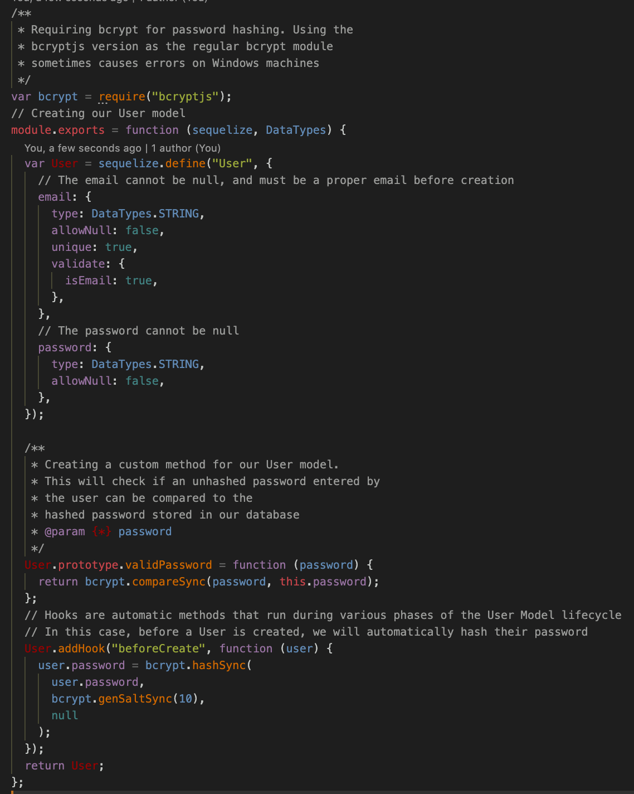
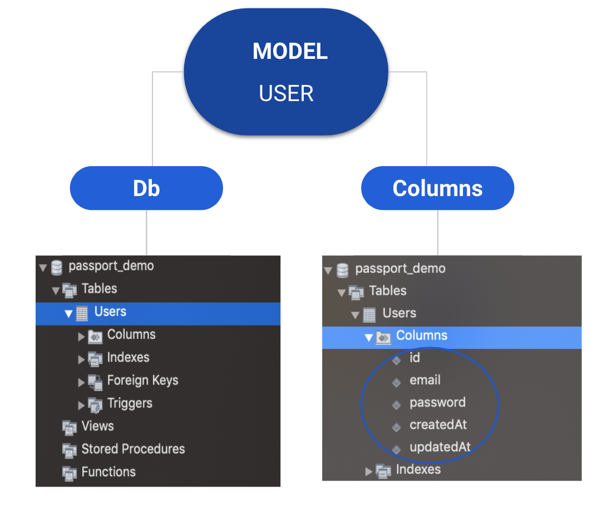
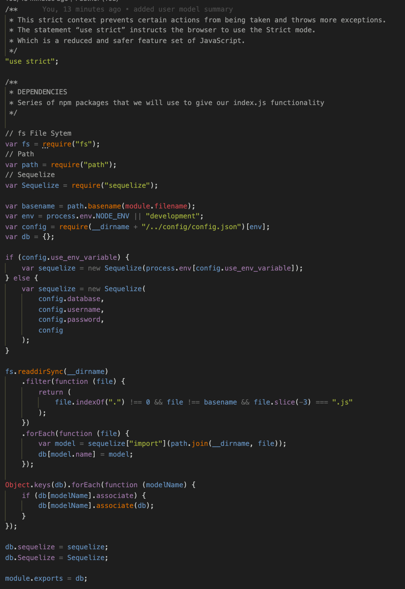

# Reverse Engineering Code

## Description

A tutorial explaining _every_ file and its purpose.

---

## User Story

```
AS A developer

I WANT a walk-through of the codebase

SO THAT I can use it as a starting point for a new project
```

## Developing

This project is based on **MVC** (_model-view-control_) **design** that separates bussiness logics, UI design and user interaction.

<div align="center">

</div>

---

## Key Files

#### Below is a summary of the key files for this project and their purpose:

- _**package.json**_ `node package definition (Node Package)`

- _**server.js**_ `main application entry point (Server)`

- _**Develop/config**_ `contains the project configuration files (Configuration)`

- _**Develop/models**_ `utilities that represents the application core logics (Model)`

- _**Develop/public**_ `utilities that displays the data (View)`

- _**Develop/routes**_ `utilities handles the input to our database (Controller)`

<div>

</div>

#### Dependecies used by the project and for this project and their purpose:



_**bcryptjs**_ `Is used to obtain secure random numbers.`

_**express**_ `A web application framework for Node.js. It is designed for building web applications and APIs.`

_**express_session**_ `Every user of your API or website will be assigned a unique session, and this allows you to store the user state.`

_**mysql2**_ `A modern, simple and very fast MySQL library.`

_**password**_ `Is a simple server-side memorable password generator for Node.js.`

_**passport-local**_ `Lets the user authenticate using a username and password in your Node. js applications.`

_**sequelize**_ `Used since the beginning in order to automate the creation of every table in your database.`

---

## Files walk-through

### server.js

_**Server.js**_ `This file is the initial starting point for the Node/Express server.`



---

### user.js

_**user.js**_ `Model deals with the business layer that is classes and the properties.`

_**Purporse:**_

- Creating our user model.
- Define the user table using Sequelize.



_**Result: Diagram that represents the Model (User).**_



---

### index.js

_**index.js**_ `Initialize sequalize db connection.`

_**Purporse:**_

    -  Uses optional Environment Variable (env) to specify if you are in dev or production.
    -  And uses the configurations for that environment from a _config_ file.


