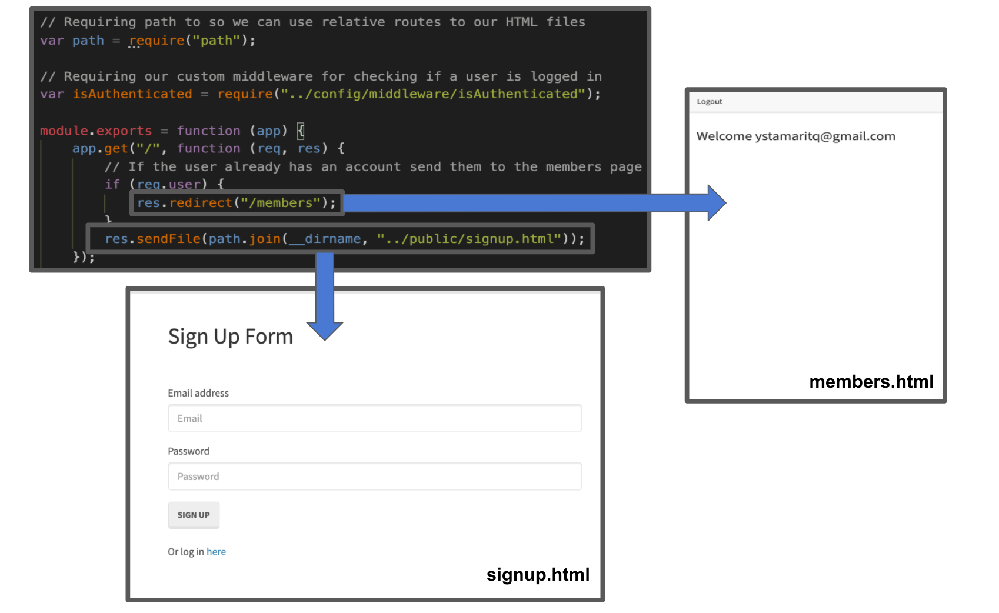

# Reverse Engineering Code

## Description

A tutorial explaining _every_ file and its purpose.

---

## User Story

```
AS A developer

I WANT a walk-through of the codebase

SO THAT I can use it as a starting point for a new project
```

## Installing / Getting Started

To test this project, simply follow these steps:

```
step 1: clone https://github.com/ystamaritq/reverse-engineer.git
step 2: install node https://nodejs.org/en/download/
step 3: npm install
step 4: change the config.json file password
step 4: node server.js
```

## Developing

This project is based on **MVC** (_model-view-control_) **design** that separates bussiness logics, UI design and user interaction.

<div align="center">

</div>

---

## Project Structure

#### Below is a summary of the key files for this project and their purpose:

- _**package.json**_ `node package definition (Node Package)`

- _**server.js**_ `main application entry point (Server)`

- _**Develop/config**_ `contains the project configuration files (Configuration)`

- _**Develop/models**_ `utilities that represents the application core logics (Model)`

- _**Develop/public**_ `utilities that displays the data (View)`

- _**Develop/routes**_ `utilities handles the input to our database (Controller)`

<div>

</div>

#### Dependecies used by the project and for this project and their purpose:


_**bcryptjs**_ `Is used to obtain secure random numbers.`

_**express**_ `A web application framework for Node.js. It is designed for building web applications and APIs.`

_**express_session**_ `Every user of your API or website will be assigned a unique session, and this allows you to store the user state.`

_**mysql2**_ `A modern, simple and very fast MySQL library.`

_**password**_ `Is a simple server-side memorable password generator for Node.js.`

_**passport-local**_ `Lets the user authenticate using a username and password in your Node. js applications.`

_**sequelize**_ `Used since the beginning in order to automate the creation of every table in your database.`

---

## Files walk-through

### config

**purporse:**

- contains the project configuration files.
- setting middleware for restricting routes a user is not allowed to visit if not logged in.
- passport configuration file.
- config.json.
  - here is an overview of the file where the dialect using by the project is (_mysql_) in order to run the app you must change this file password to your password.


### server.js

_**Server.js**_ `This file is the initial starting point for the Node/Express server.`

**purporse**

- Setting an initial port and requiring models for syncing.
  `var PORT = process.env.PORT || 8080;`
- Creating our server.
- `var app = express()`
- Sets passport initialization middleware.
  - `app.use(passport.initialize())`
- Import routes and give the server access to them
  - `require("./routes/html-routes.js")(app)`
  - `require("./routes/api-routes.js")(app)`
- Automatically synchronize all models using `db.sequelize.sync()`.


**Console Results** after running the `node server.js`.


---

## Models

### user.js

_**user.js**_ `Model deals with the business layer that is classes and the properties.`

_**Purporse:**_

**The following code** is _creating_ our User model using Sequelize.


**Where:**

- **User**: is the table
- **email**: is a column
- **password**: is a column
- Also use the _define_ **method**. _Sequelize_ will then automatically add the attributes _createdAt_ and _updatedAt_ to it.

_**Result: Diagram that represents the Model (User).**_


**The example below** is setting a value to the user model password before saving it, using the **beforeCreated** _Sequelize hook_ and _**bcryptjs**_ package.bhv


**Resulting the following db output**


<details>
<summary>user js image with comments</summary>

</details>

---

### index.js

_**index.js**_ `Initialize sequalize db connection.`

_**Purporse:**_

`Uses optional Environment Variable (env) to specify if you are in dev or production. And uses the configurations for that environment from a _config_ file.`

<details>
<summary>index js image with comments</summary>

</details>

## Controller

Any file inside the folder **_routes_** refers to determining how an application responds to a client request to a particular endpoint, which is a URI (or path) and a specific HTTP request method (GET, POST, and so on).

#### _**api_routes**_

`App handler functions, which are executed when the route \api\* is matched`

**The following API route** `/api/user_data` handles a **json** response:


**Where:**

- app is an instance of express.
- GET is an HTTP request method, in lowercase.
- PATH is `/api/user_data` on the server.
- HANDLER is the function executed when the route is matched.

---

**The following examples** shows a **route** and its handler function _(Connect middleware)_. The function handles POST requests to the `/api/login` path & . If this function gets called, authentication was successful. `req.user` contains the authenticated user.


<details>
<summary>api_routes code image with comments</summary>

</details>

#### _**html_routes**_

`The following code demostrates how the Controller handle the data and returning the resulting page to the user to view in the browser. In this specific case:`

- If the user go the the following path (/) the res (response) => **signup.html**

- But is the user already has an account the response is redirect to the => **members.html.**

- If the user go to this route (/login) the res (response) resulting page to the user to view in the browser will be **login.html**.

`Ilustration image:`



## Views

`The controller responds to the user input and performs interactions on the data model objects. It includes anything that the user can see.`

The **public folder** contains all the _**views**_ `(html, css, js) files` used by the project.


The following js files `login.js`, `members.js`, and `signup.js` have the functionality to handle the interactive elements for web page. Allows the users to _interact_ with the web pages.

**JS Files**

**login** js file handle user interaction when the user => login to the page.

**purporse** sending an AJAX POST-request with jQuery `$.post("/api/login", { email: email, password: password})`


**signup** js file handle user interaction when the user going to => signup to the page.

**purporse** sending an AJAX POST-request with jQuery `$.post("/api/signup", { email: email, password: password})`


**members** js file handle user interaction when the user is a => members to the page.

**purporse** when the page loads, grab all of our users and sending an **AJAX-GET** request with jquery `$.get("/api/user_data")`.


**style.css** Cascading Style Sheet.

**purporse:** It's used to define the styles of the webpages, in this specific project is just used to define the forms margins:

```

form.signup,
form.login {
margin-top: 50px;
}

```

**The html files** will include all the UI components such as forms, text boxes, buttons, etc used by the html templates.


### Project improvement

- Use handlebars as the project template engine.
- Improve UI design.
